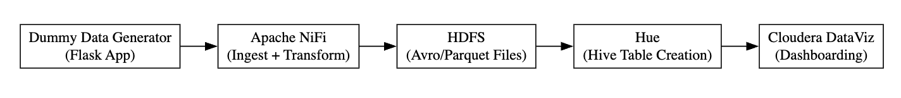
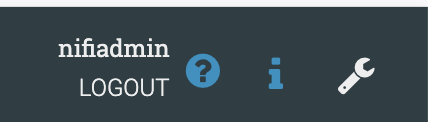
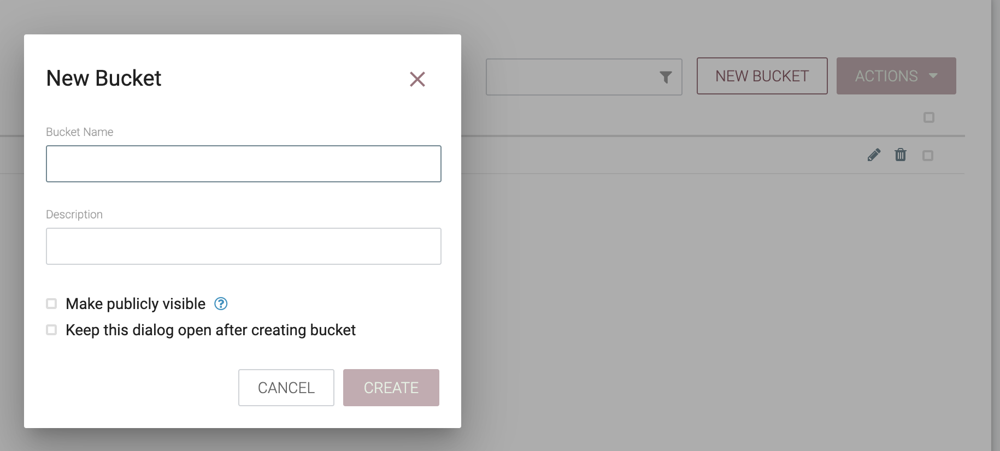
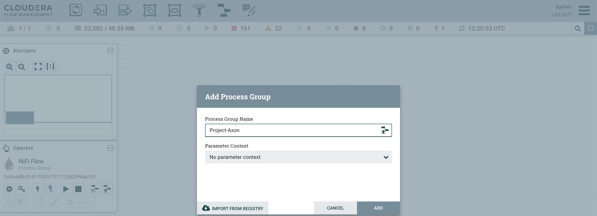
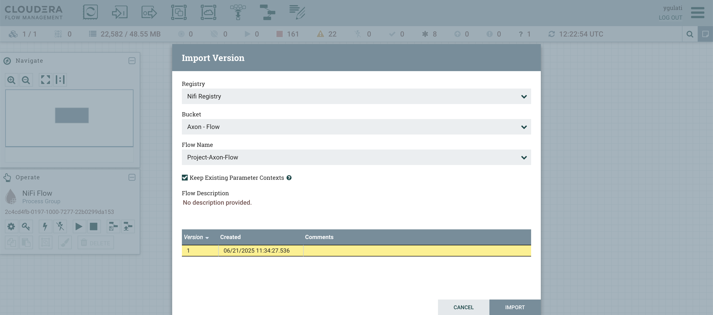
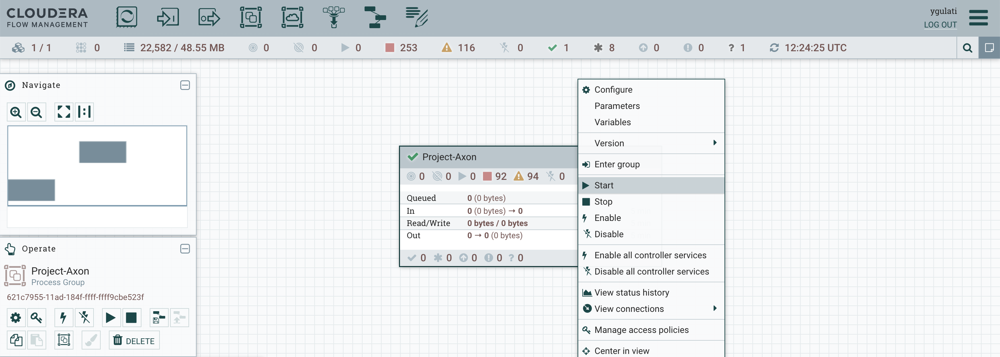
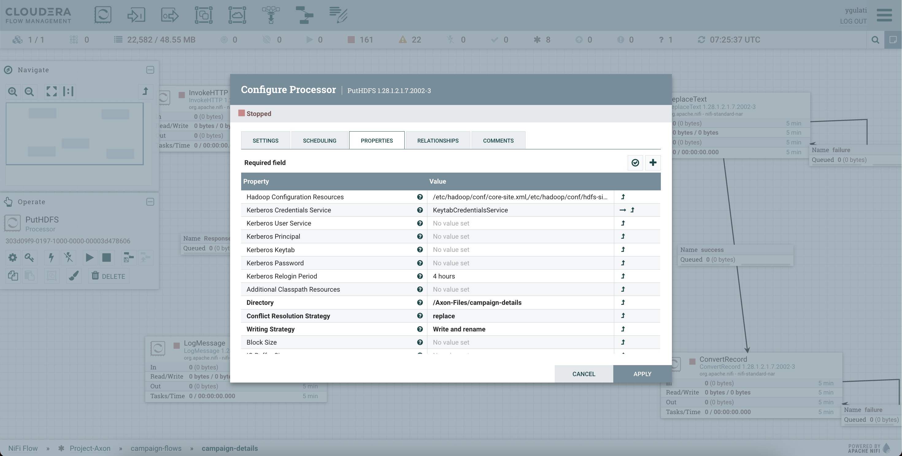
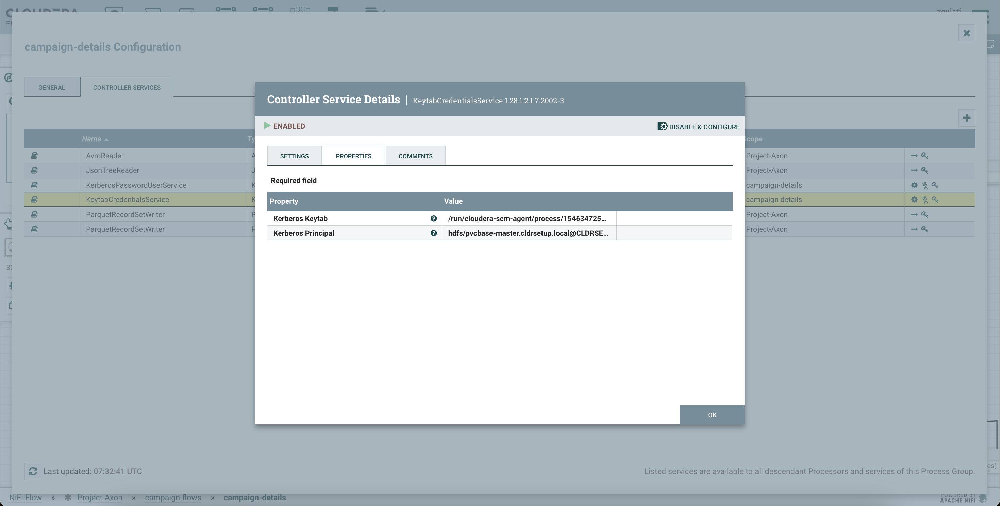
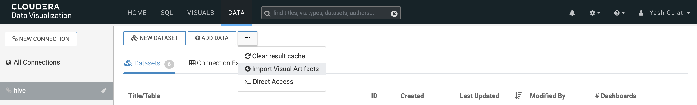
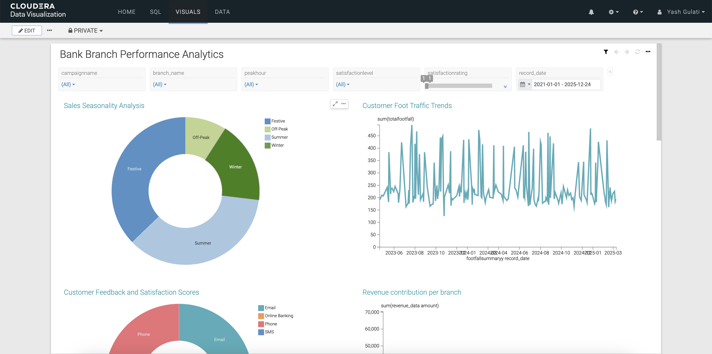

= Project Axon: Bank Branch Performance Analytics
:author: Yash Gulati
:revdate: 2025-06-20
:toc:
:toclevels: 2

== Introduction

*Project Axon* is a comprehensive end-to-end demonstration of Cloudera’s capabilities across the full data lifecycle — from data ingestion to dashboarding. 

The goal of this project is to help partners:
- Understand how to practically use Cloudera Private Cloud for real-time and batch analytics.
- Identify a relevant and easy-to-explain use case.
- Showcase a ready-to-deploy demo to customers after initial discovery conversations.

**Use Case Chosen:** *Bank Branch Performance Analytics*

This use case helps simulate and analyze the operational performance of various bank branches using dummy data, allowing visual insights via dashboards.

== Prerequisites

Before running the project, ensure the following components are installed:

=== On the Dummy Data Generator Host:
[source,shell]
----
sudo yum install -y python3
python3 -m ensurepip --upgrade
pip3 install Flask
pip3 install Faker
python3 -m flask --version
pip3 install uvicorn
pip3 install fastapi
----

=== Cloudera Platform Requirements:
You should have a **Cloudera Private Cloud Base cluster** running with the following services enabled:

- Apache NiFi  
- NiFi Registry  
- HDFS  
- Hue  
- Cloudera DataViz  
- Hive  
- Impala  
- Apache Knox

This project was developed and tested on the following component versions:

- **Cloudera Manager**: 7.11.3-CHF11  
- **CDP Base Runtime (CDH parcel)**: 7.1.9 SP1 CHF4  
- **Java**: 17.0.15  
- **Cloudera Flow Management (CFM)**: 2.1.7.2002-3  
- **Apache NiFi**: 1.28.1  
- **Cloudera DataViz**: 8.0.4-b47.p1.67141340

== Technology Stack

- **Data Generator**: Python (Flask + Faker)
- **Data Ingestion**: Apache NiFi
- **Storage**: HDFS (Parquet format)
- **Data Query Layer**: Hive tables created via Hue
- **Visualization**: Cloudera DataViz

== Project Workflow

== Steps to Run

=== 1. Clone the Dummy Data Generator Repository

You can clone and run this dummy generator app on **any of the base cluster servers** you have access to.  
Just make sure the following ports are open on the server firewall/security groups:  
**8000, 8085, 5001, 5003, 5400, 5500**

[source,shell]
----
git clone https://github.com/yashgulati-sudo/Project-Axon.git
cd Project-Axon/Project-Axon-Data
./run_all.sh
----

=== 2. Configuration on `NiFi Registry` UI

.. Login to the `NiFi Registry` UI.
.. Create a new bucket (for example, name it `Axon-Files`).
... Click on the wrench `🔧` icon on the top right corner to open settings.
+

... Click on *New bucket* and name it `Axon-Flow`.
+

=== 3. Import the NiFi Flow into NiFi from Registry

- Go to NiFi UI.
- Drag a new **Process Group** onto the canvas.
- Give it any name (e.g., `Project-Axon`).
+

+
- After naming it, click **Import from Registry**.
- Select the `Axon-Flow` bucket, choose the `Project-Axon` flow and desired version, then click **Import**.
+

+
- Inside the process group, right-click and select **Start**.
+

NOTE: After starting the flow, run it for a maximum of 5 minutes. It will generate approximately **50–80 flow files**.  
After that, right-click and click **Stop**, otherwise it will continue generating files indefinitely.

IMPORTANT: While importing or configuring the flow, **note down the Kerberos Keytab path and Kerberos Principal** (you'll need these while configuring the `PutHDFS` processor in the next step).

=== 4. Configure Apache NiFi (HDFS Access)

To enable Hue and Hive to read files from HDFS, ensure NiFi has authenticated HDFS access using Kerberos.

==== Step 1: Locate the HDFS keytab file
[source,shell]
----
find / -name hdfs.keytab
----

==== Step 2: Verify keytab contents (optional)
[source,shell]
----
klist -kt /run/cloudera-scm-agent/process/1546343796-hdfs-NAMENODE/hdfs.keytab
----

==== Step 3: Authenticate with Kerberos
[source,shell]
----
kinit -kt /run/cloudera-scm-agent/process/1546343796-hdfs-NAMENODE/hdfs.keytab hdfs/pvcbasemaster.cldrsetup.local@CLDRSETUP.LOCAL
----

==== Step 4: Create HDFS target directory
[source,shell]
----
hdfs dfs -mkdir /Axon-Files
----

==== Step 5: Configure `PutHDFS` in NiFi

- Open the **PutHDFS** processor inside the process group.
- In the *Kerberos Credentials Service* field, click the arrow (`→`) to navigate to the controller service.
+

+
- Click the **gear icon** (⚙️) to open the settings configuration.
- In the settings configuration, provide: **Kerberos Principal** and **Kerberos Keytab** file path.
+

+
- Save and enable the controller service.

=== 5. Create Hive Tables via Hue

Go to Hue → Query Editor → Hive and run a sample query for one dataset (e.g., branches):

You can use the pre-written queries available in the `create_queries.txt` file located in the cloned folder.
For example, to create the `bank_branches` table:
[source,sql]
----
CREATE EXTERNAL TABLE branches (
  branch_id INT,
  branch_name STRING,
  location STRING,
  region STRING,
  manager_id STRING,
  IFSCCode STRING,
  established_date STRING
)
STORED AS PARQUET
LOCATION '/Axon-Files/BMS/branches/';
----

Repeat similar steps for the other datasets using the queries from the file.

=== 6. Import Dashboard into DataViz

- Go to Cloudera DataViz → *Data* tab → *Import visual artifacts*.
+

+
- Upload the dashboard JSON file: `project_axon_dashboard.json`.
- Once imported, navigate to the *Visuals* tab and click on the dashboard to open and view it.
+

== Contact

For questions, feedback, or demo support, please reach out to the **Partner Solutions Engineering** team at Cloudera.
